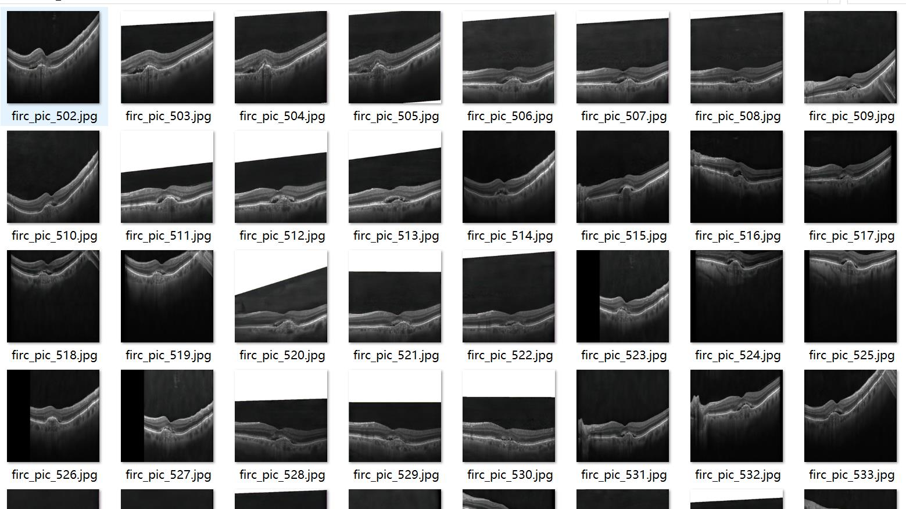
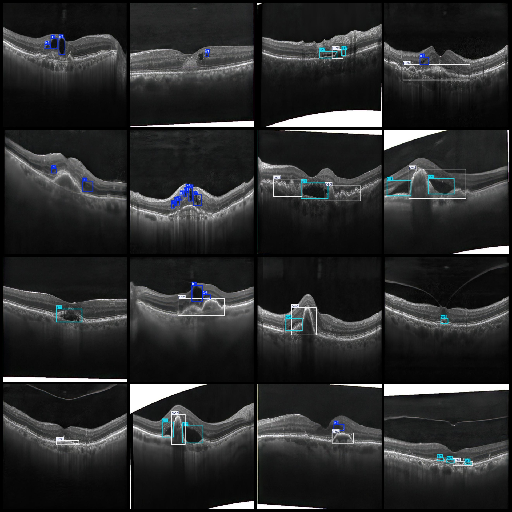
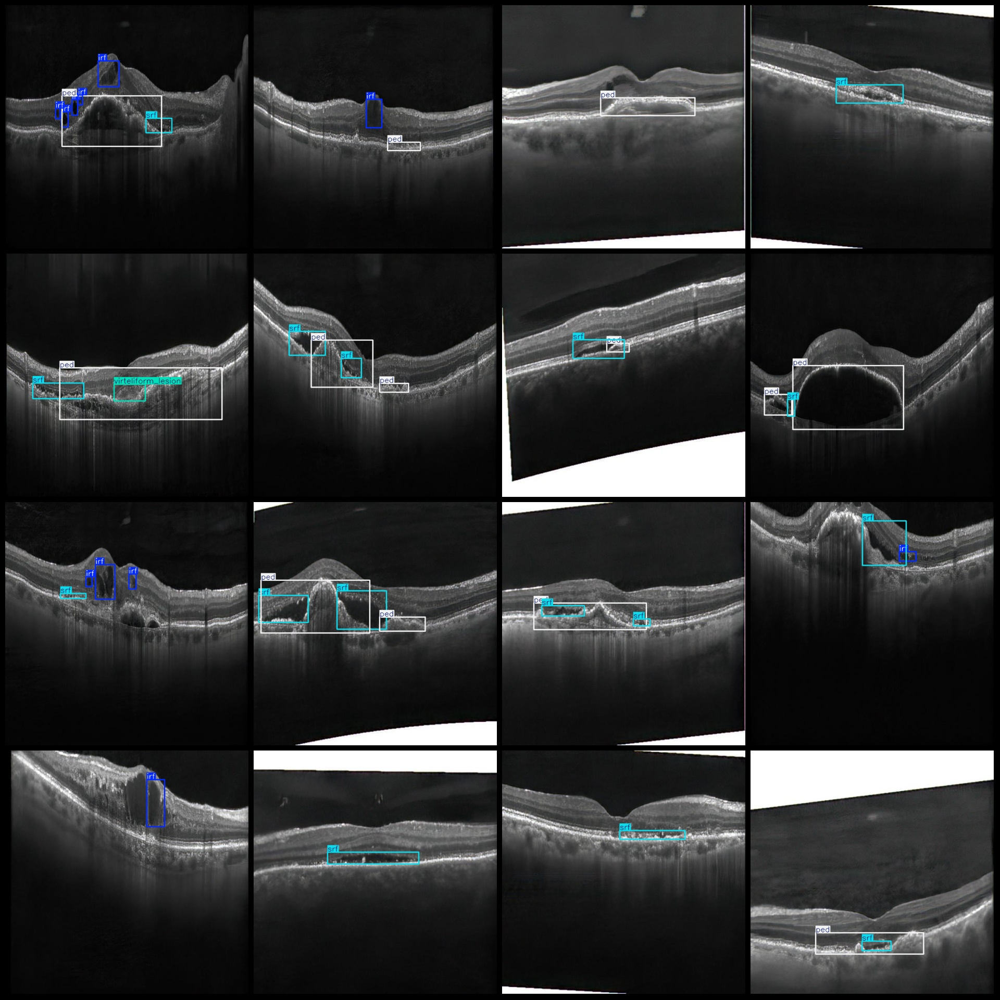

# Intelligent Medical OCT Retinal Disease Detection Dataset VOC+YOLO Format with 5099 Images in 6 Categories

Dataset format: Pascal VOC format+YOLO format (Without split path in txtfile, only contain jpg image and corresponding VOC format xmlfile and yolo format txtfile)

number of images: 5099
annotation count: 5099
annotation count: 5099
annotationnumber of classes: 6
Annotation class names: ["irf", "organized_subretinal_scar", "ped", "srf", "subretinal_hyperreflective_material", "virteliform_lesion"]

Number of boxes labeled in each category:

- Irf (Retinal Internal High Reflectance Point) box count = 4878
- Orgainized Subretinal Scar (Organized Subretinal Scar) box count = 326
- Peed (Pigment Epithelial Detachment) box count = 3611
- Srf (Subretinal Fluid) box count = 3794
- Subretinal Hyperreflective Material (Subretinal Hyperreflective Material) box count = 91
- Virteliform Lesion (Vitreous Tumor-like Lesion) box count = 194

Total frame count: 12894

images per class: 

- IRF (Intraretinal Fluorescein Enhancement) accounted for 2025 images
- organized_subretinal_scars (Organized Subretinal Scars) accounted for 322 images
- PED (Pigment Epithelium Detachment) accounted for 3249 images
- SRF (Subretinal Fluid) accounted for 2927 images
- subretinal_hyperreflective_material (Subretinal Hyperreflective Material) accounted for 91 images
- Virteliform Lesions (Virteliform Lesions) accounted for 194 images

Image resolution: 640x640

Use the labeling tool: labelImg

Markup Rules: Draw a rectangle around categories

Important notes: The dataset does not have a division into training, validation, and test sets. You will need to manually divide it yourself.

Special Disclaimer: This dataset does not guarantee the accuracy of the trained models or weight files.

Preview of the image:
## Image

Here is a pay link on Stripe ( https://buy.stripe.com/3cs8yP7sY87d0vu9AB ). Please contact me lonlonago@foxmail.com after funding $89, and I will send you a complete data files , thank you!

